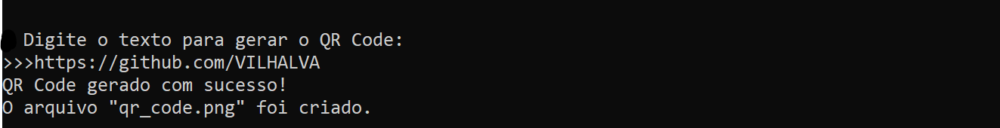
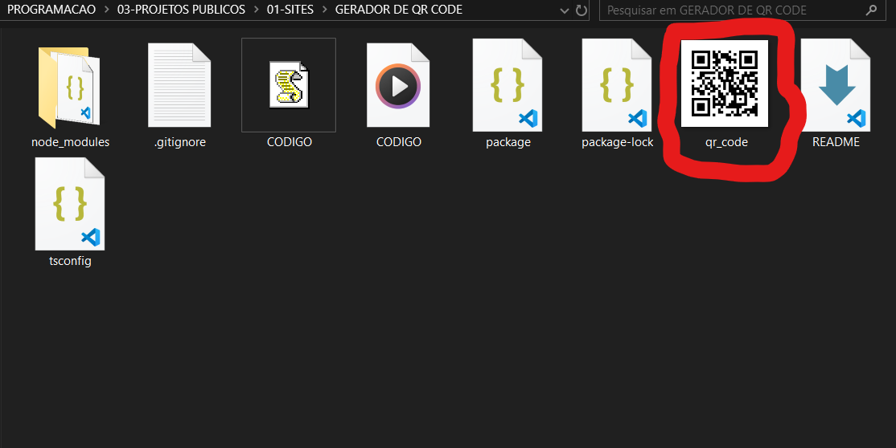

# GERADOR DE QR CODE
👨‍🏫GERADOR DE QR CODE EM PNG PELO CONSOLE UTILIZANDO NODE.JS E TYPESCRIPT.

 <br> <br> 
 <br> <br>

## DESCRIÇÃO:
O Gerador de QR Code é um pequeno aplicativo de linha de comando desenvolvido em TypeScript que permite aos usuários gerar códigos QR a partir de texto inserido pelo usuário. Este projeto utiliza a biblioteca `qrcode` para criar os códigos QR e o módulo `fs` para salvar o código QR gerado em um arquivo PNG.

## RECURSOS:
1. **Entrada de Texto Interativa:** O aplicativo solicita ao usuário que insira o texto que deseja codificar em um QR Code. Utiliza-se a biblioteca `readline` para interagir com o usuário através do console.

2. **Validação de Entrada:** Antes de gerar o QR Code, o aplicativo valida o texto inserido para garantir que não esteja vazio. Se o usuário tentar inserir um texto vazio, uma mensagem de erro será exibida e o usuário será solicitado a fornecer um texto válido.

3. **Geração de QR Code:** Uma vez que o usuário fornece um texto válido, o aplicativo utiliza a biblioteca `qrcode` para gerar o código QR correspondente ao texto inserido.

4. **Salvar QR Code em Arquivo PNG:** O código QR gerado é então salvo em um arquivo PNG, usando o módulo `fs`. O nome do arquivo é definido como "qr_code.png".

5. **Feedback:** Após a geração bem-sucedida do QR Code e sua gravação no arquivo, o aplicativo fornece feedback ao usuário, exibindo uma mensagem indicando que o QR Code foi gerado com sucesso e mostrando o nome do arquivo onde o QR Code foi salvo.

## EXECUTANDO O PROJETO:
1. **Instalação das Dependências:**
    Certifique-se de que você tenha o Node.js instalado em seu sistema. Em seguida, navegue até o diretório onde o código-fonte do aplicativo está localizado e execute o seguinte comando para instalar as dependências:
    ```bash
    npm install -y
    ```

2. **Copilando:**
    Após instalar as dependências, compile o arquivo TypeScript (CODIGO.ts) para JavaScript usando o TypeScript Compiler (tsc):
    ```bash
    npx tsc CODIGO.ts
    ```

3. **Executando:**
    Execute o aplicativo pelo NODEJS digitando:
    ```bash
    node CODIGO.js
    ```

4. **Interagindo com o Aplicativo**:
    - Quando solicitado, insira o texto que deseja codificar no QR Code. E clique em `ENTER`.
    - Aguarde até que o aplicativo gere o QR Code e salve-o no arquivo PNG.
    - Verifique o diretório onde o aplicativo foi executado para encontrar o arquivo "qr_code.png" com o QR Code gerado. (É salvo no mesmo diretório do projeto).

## NÃO SABE?
- Entendemos que para manipular arquivos em `HTML`, `CSS` e outras linguagens relacionadas, é necessário possuir conhecimento nessas áreas. Para auxiliar nesse aprendizado, oferecemos cursos gratuitos disponíveis:
* [CURSO DE HTML E CSS](https://github.com/VILHALVA/CURSO-DE-HTML-E-CSS)
* [CURSO DE NODEJS](https://github.com/VILHALVA/CURSO-DE-NODEJS)
* [CURSO DE TYPESCRIPT](https://github.com/VILHALVA/CURSO-DE-TYPESCRIPT)
* [CONFIRA MAIS CURSOS](https://github.com/VILHALVA?tab=repositories&q=+topic:CURSO)

## CREDITOS:
- [PROJETO CRIADO PELO VILHALVA](https://github.com/VILHALVA)


